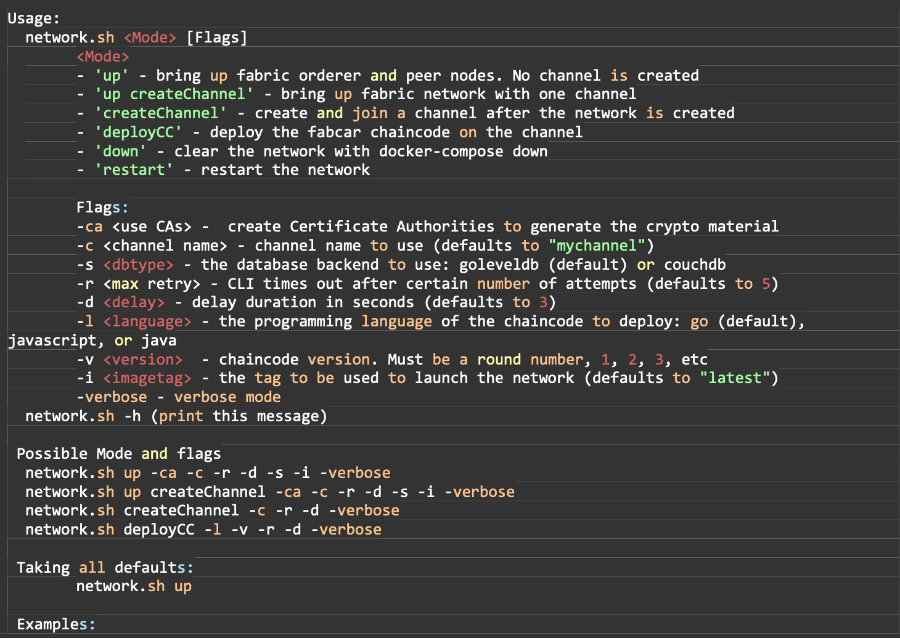
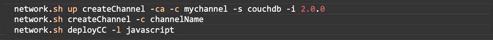


# Proyecto 1: Crear e interactuar con una red de Hyperledger Fabric

En este proyecto crearemos un red de Hyperledger Fabric de pruebas en una máquina local y añadiremos un canal a la red.

1. Usar la red de test de Fabric.
2. Arrancar la red
3. Los componentes de la red
4. Crear un canal
5. Iniciar chaincode en el canal
6. Interactuar con la red
7. Parar la red

## 1. Usar la red de test de Fabric

Antes de empezar con el proyecto hay que descargar las imágenes Docker de Hyperledger Fabric y descargar repositorio Github de fabric-samples.
La red de test se utiliza para con fin educativo, no debe utilizarse como una red en producción.

La red Fabric se deplega utilizando Docker Compose.

## 2. Arrancar la red de test

Accedemos al directorio de `test-network`:
`cd fabric-samples/test-network`

En este directorio encontramos el script `network-sh` que nos permitirá arrancar la red de Fabric usando la imágenes de Docker en nuestra máquina local.

El comando `./network.sh -h` nos proporciona una ayuda sobre el script.

Dentro de la carpeta `test-network`, podemos ejecutar el comando `./network.sh down` para eliminar cualquier container ya creado una vez arrancada la red.

Para arrancar la red usamos el comando: `./network.sh up`. Este comando nos creará una red de Fabric con dos nodos peer y un nodo ordering.

IMAGEN1.1

De forma predefinida la red utiliza la herramienta `cryptogen`, aunque podemos arrancar la red sin los certificados de autoridad.

## 3. Componentes de la res de pruebas.

Una vez la red desplegada, podemos examinar los componentes que componen nuestra red: 
`docker ps -a`

La red de pruebas esta formada por dos consorcios: Org1 y Org2. Además de una organización orderer que mantiene el ordering service de la red.
Los peers de la red almacenan la ledger y validan las transacciones antes de que se añadan a la ledger. También ejecutan en chaincode.
La red tiene dos peers: 
- peer0.org1.example.com
- peer1.org2.example.com

El ordering service gestiona y decide en que orden se ejecutan las transacciones y se añaden a la ledger, para luego distribuir los bloques a los peers y que los añadan a la ledger. 

La red de pruebas utiliza un solo nodo Raft ordering service que es gestionado por la organización ordering `orderar.example.com`. Una red real puede utilizar varios nodos ordering.

## 4. Crear un canal

En nuestra máquina local tenemos 2 peers de dos organizaciones diferentes y un nodo ordering.
Vamos a crear un canal entre Org1 y Org2. Los canales solo pueden ser usados por las organizaciones que tienen acceso a él y son invisibles a otros miembros de la red.

Podemos utilizar el siguiente comando para crear un canal con el nombre de `mychannel` para las organizaciones Org1 y Org2:

`./network.sh createChannel`

Podemos utilizar el siguiente comando para crear un canal con el nombre que queramos: 
`./network.sh createChannel -c channel1`

Podemos crear otro canal: 
`./network.sh up createChannel -c channel2`

Para crear un canal en un solo paso usamos el comando: 
`./network.sh up createChannel`

## 5. Iniciar chaincode en un canal

Una vez creado el canal podemos empezar a utilizar chaincode para interactuar con la ledger del canal.
Para firmar una transacción cada organización necesita invocar y ejecutar el chaincode en su peer y finalmente firmar la transacción de salida. Si la salida ha sido firmada por las suficientes organizaciones la transacción puede ser añadida a la ledger.
El chaincode se instala en cada peer de una organización y después se desplega en el canal. 
Podemos iniciar un chaincode en el canal con el comando: 
`./network.sh deployCC`
Este comando instalará el chaincode `fabcar` en los peers peer0.org1.example.com y peer0.org1.example.com; y desplegará el chaincode en el canal.

Por defecto se instalará la versión en Go, pero podemos instalar la versión de Java o Javascript utilizando el parámetro `-l`.

Si el comando se ha ejecutado correctamente podemos ver lo siguiente: 

IMAGEN2

## 6. Interactuar con la red

Podemos utilizar el peer CLI para interactuar con la red. El peer CLI nos permite invocar chaincode, actualizar canales o instalar y desplegar nuevo chaincode.
Podemos encontrar los binarios del peer en la carpeta `bin` en el repositorio de `fabric-samples`. Podemos utilizar el siguiente comando para añadir los binarios al CLI Path:
`export PATH=${PWD}/../bin:${PWD}:$PATH`
`export FABRIC_CFG_PATH=$PWD/../config/`

Podemos configurar las variables de entorno que nos permitirá operar el peer CLI como Org1.

`export  CORE_PEER_TLS_ENABLED=true`

`export  CORE_PEER_LOCALMSPID="Org1MSP"`

`export CORE_PEER_TLS_ROOTCERT_FILE=${PWD}/organizations/peerOrganizations/org1.example.com/peers/peer0.org1.example.com/tls/ca.crt`

`export CORE_PEER_MSPCONFIGPATH=${PWD}/organizations/peerOrganizations/org1.example.com/users/Admin@org1.example.com/msp`

`export CORE_PEER_ADDRESS=localhost:7051`

Podemos interactuar con el chaincode desde nuestra CLI ejecutando el siguiente comando: 
`peer chaincode query -C mychannel -n fabcar -c '{"Args":["queryAllCars"]}' `

Podremos ver una lista de coches.

IMAGEN3

Podemos invocar chaincode para cambiar el propietario de un coche:
`
peer chaincode invoke -o localhost:7050 --ordererTLSHostnameOverride orderer.example.com --tls --cafile ${PWD}/organizations/ordererOrganizations/example.com/orderers/orderer.example.com/msp/tlscacerts/tlsca.example.com-cert.pem -C mychannel -n fabcar --peerAddresses localhost:7051 --tlsRootCertFiles ${PWD}/organizations/peerOrganizations/org1.example.com/peers/peer0.org1.example.com/tls/ca.crt --peerAddresses localhost:9051 --tlsRootCertFiles ${PWD}/organizations/peerOrganizations/org2.example.com/peers/peer0.org2.example.com/tls/ca.crt -c '{"function":"changeCarOwner","Args":["CAR9","Dave"]}'
`

Podemos cambiar la configuración para ejecutar chaincode desde la Org2.

`export  CORE_PEER_TLS_ENABLED=true`

`export  CORE_PEER_LOCALMSPID="Org2MSP"`

`export  CORE_PEER_TLS_ROOTCERT_FILE=${PWD}/organizations/peerOrganizations/org2.example.com/peers/peer0.org2.example.com/tls/ca.crt`

`export  CORE_PEER_MSPCONFIGPATH=${PWD}/organizations/peerOrganizations/org2.example.com/users/Admin@org2.example.com/msp`

`export  CORE_PEER_ADDRESS=localhost:9051`

Podemos interactuar con el chaincode desde la peer0.org2.example.com con el comando: 
`peer chaincode query -C mychannel -n fabcar -c '{"Args":["queryCar","CAR9"]}'`

## 7. Parar la red
Para parar la red utilizamos el comando: 
`./network.sh down`

Esto comando parará y eliminará los contenedores de los nodos, chaincode, eliminará el material criptográfico, etc.
